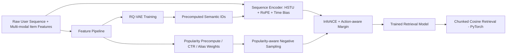

# Tencent Ads 2025 Full-Modal Generative Recommendation

[](./V7_4_7_vs_baseline_ori_full_improvements_report_zh.md)
[](./V7_4_7_vs_baseline_ori_full_improvements_report_zh.md)
[](./V7_4_7_vs_baseline_ori_full_improvements_report_zh.md)

Single-author competition solution for **Tencent Advertising Algorithm Competition 2025** (full-modal generative recommendation).

- Competition result: **65 / 2800+ (Top 5%)**
- Final leaderboard score: **0.106558**
- Timeline: **2025.08 - 2025.09**

---

## 中文版（CN）

### 1. 项目背景
本项目面向腾讯广告真实业务场景的全模态生成式推荐任务：
基于脱敏后的用户行为序列与多模态 item 特征，进行 Top-K 推荐。

核心目标不是“单纯降低训练 loss”，而是提升排序质量指标与榜单分数。

### 2. 成绩概览
- 榜单成绩：**65 / 2800+（前 5%）**
- 最终分数：**Score = 0.106558**（文中有时写作 0.106，为四舍五入）
- 相对 baseline：文档中记录为约 **+500%**（见报告指标口径）

榜单截图（官方页面）：


图中关键信息：
- 排名：**65**
- 最佳成绩：**0.106558**
- 最佳成绩提交时间：**2025-09-15 06:54:15**

指标留档：

| 指标 | baseline） | final  | 说明 |
|---|---:|---:|---|
| Score | 0.0177 | 0.1060 |  |
| NDCG@10 | 0.0118 | 0.0707 |  NDCG:HR = 1:2  |
| HitRate@10 | 0.0236 | 0.1413 |  NDCG:HR = 1:2  |

说明：若后续找回精确日志，可在报告里直接覆盖估算值。

### 3. 方法总览（相对 SASRec baseline）

1. 序列建模改造
- 将标准注意力改造为 **HSTU + RoPE + 多尺度时间偏置**
- 显式建模相对位置与时间衰减，增强对近期行为与跨时间跨度交互的建模能力

2. 语义表征改造
- 引入 **RQ-VAE** 构建 item semantic ID 链路
- 采用 **EMA 码本更新 + dead code reset + 多样性约束 + 码本健康监控**，缓解码本塌缩

3. 训练目标与采样改造
- 从 baseline 的 **均匀负采样 + BCE** 升级为 **流行度感知 Alias 采样 + InfoNCE**
- 引入 **in-batch negatives / chunked loss**，在增强目标的同时控制显存

4. 工程与系统优化
- **Muon/Adam 参数分组优化**
- **BF16 混合精度训练**
- **PyTorch 分块余弦检索**（替代外部 FAISS 可执行依赖）
- 数据读取链路改造为多进程安全并支持并行提速

### 4. 技术架构


### 5. 代码结构（核心模块）
- 训练入口：[main.py](./main.py)
- 推理入口（函数）：[infer.py](./infer.py)
- 数据处理与负采样：[dataset.py](./dataset.py)
- 主模型（HSTU/InfoNCE/Action Margin）：[model.py](./model.py)
- RQ-VAE 模型：[model_rqvae.py](./model_rqvae.py)
- RQ-VAE 训练脚本：[train_rqvae.py](./train_rqvae.py)
- 流行度预计算：[precompute_popularity.py](./precompute_popularity.py)
- semantic id 预计算：[precompute_semantic_ids_offset.py](./precompute_semantic_ids_offset.py)
- 全量对照报告：[V7_4_7_vs_baseline_ori_full_improvements_report_zh.md](./V7_4_7_vs_baseline_ori_full_improvements_report_zh.md)

### 6. 环境变量与数据约定

运行前请配置以下环境变量：

```bash
export RUNTIME_SCRIPT_DIR=$(pwd)

export TRAIN_DATA_PATH=/path/to/train_data
export EVAL_DATA_PATH=/path/to/eval_data

export TRAIN_LOG_PATH=/path/to/output/logs
export TRAIN_TF_EVENTS_PATH=/path/to/output/tensorboard
export TRAIN_CKPT_PATH=/path/to/output/checkpoints

export USER_CACHE_PATH=/path/to/cache
export EVAL_RESULT_PATH=/path/to/eval_result
export MODEL_OUTPUT_PATH=/path/to/model_dir
```

数据目录关键文件：

- 训练数据目录（`TRAIN_DATA_PATH`）
  - `seq.jsonl`
  - `seq_offsets.pkl`
  - `indexer.pkl`
  - `item_feat_dict.json`
  - `creative_emb/`
- 推理数据目录（`EVAL_DATA_PATH`）
  - `predict_seq.jsonl`
  - `predict_seq_offsets.pkl`
  - `predict_set.jsonl`
  - `indexer.pkl`
  - `item_feat_dict.json`
  - `creative_emb/`

### 7. 快速复现（推荐）

1) 安装 Muon 轮子（可选但推荐）
```bash
pip install ./muon_optimizer-0.1.0-py3-none-any.whl
```

2) 预计算流行度与采样权重
```bash
python precompute_popularity.py --data_dir "$TRAIN_DATA_PATH"
```

3) 训练 RQ-VAE（若使用语义 ID）
```bash
python train_rqvae.py \
  --features 81 82 84 86 \
  --device cuda \
  --epochs 5 \
  --batch_size 1024 \
  --lr 0.002 \
  --enable_mixed_precision
```

4) 预计算 semantic id（train + eval）
```bash
python precompute_semantic_ids_offset.py \
  --features 81 82 84 86 \
  --data_type both \
  --device cuda \
  --batch_size 1024 \
  --force_recompute
```

5) 训练主模型
```bash
bash run.sh
```

6) 推理（平台通常调用 `infer.infer()`）
```python
from infer import infer

top10s, user_list = infer()
print(len(top10s), len(user_list))
```

### 8. 关注点
- 训练目标从 point-wise BCE 升级为 set-wise InfoNCE，并加入动作边际与样本级加权
- 时间建模不是“加时间特征”而是“特征层 + 注意力打分层”双路径融合
- 语义链路不是简单离散化，而是带码本健康管理与可落地缓存系统
- 推理检索强调训练-推理度量一致性（统一 L2 + 余弦）与工程可移植性

---

## English (EN)

### 1. Problem Context
This project targets a real-world full-modal generative recommendation task in Tencent Ads.
Given anonymized user behavior sequences and multimodal item features, the goal is Top-K recommendation with strong ranking quality.

### 2. Results Snapshot
- Final rank: **65 / 2800+ (Top 5%)**
- Final score: **0.106558** (sometimes shown as 0.106 after rounding)
- Relative to baseline: approximately **+500%** (documented in the report with explicit assumptions)

Leaderboard screenshot:


Key evidence in the screenshot:
- Rank: **65**
- Best score: **0.106558**
- Best submission time: **2025-09-15 06:54:15**


### 3. What Changed vs Baseline (SASRec-style)
1. Sequence modeling
- Replaced standard attention with **HSTU + RoPE + multi-scale time bias**

2. Semantic representation
- Introduced **RQ-VAE semantic IDs**
- Added **EMA codebook updates, dead-code reset, diversity regularization, and codebook health monitoring**

3. Training objective and negatives
- Upgraded from **uniform negatives + BCE** to **popularity-aware Alias negatives + InfoNCE**
- Added **in-batch negatives + chunked loss** for stronger contrastive learning under memory constraints

4. System optimization
- **Muon/Adam grouped optimization**
- **BF16 mixed-precision training**
- **Chunked cosine retrieval in PyTorch**
- Multi-process-safe data reading for stable and faster pipeline throughput

### 4. Reproducibility
- Main training entry: [main.py](./main.py)
- Inference entry function: [infer.py](./infer.py)
- Full report: [V7_4_7_vs_baseline_ori_full_improvements_report_zh.md](./V7_4_7_vs_baseline_ori_full_improvements_report_zh.md)

Please follow the same environment-variable setup and step-by-step commands in the Chinese section.

### 5. Suggested Reading Order
1. [README.md](./README.md)
2. [V7_4_7_vs_baseline_ori_full_improvements_report_zh.md](./V7_4_7_vs_baseline_ori_full_improvements_report_zh.md)
3. [model.py](./model.py) (HSTU/InfoNCE/time bias)
4. [dataset.py](./dataset.py) (sampling/time features/semantic-id loading)
5. [main.py](./main.py) and [infer.py](./infer.py)

---

## Citation / Contact
If this project helps your research or engineering implementation, please cite the report and keep a reference to this repository.

External portfolio link (from resume):
- [GitHub Profile Project Link](https://github.com/StarryKaguya/BP-SR)
